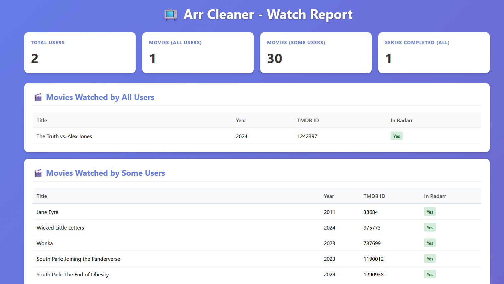

# Arr Cleaner

A tool to analyze watched content across Jellyfin users and cross-check with Sonarr and Radarr libraries.



## Features

- Connects to Jellyfin to track what movies and series have been watched by all users
- Cross-references watched content with Sonarr (TV series) and Radarr (movies)
- Identifies content watched by all users vs some users
- Distinguishes between fully watched and partially watched series
- Displays results in a clean, local web UI

## Setup

1. Install dependencies:
```bash
pip install -r requirements.txt
```

2. Copy the example configuration files:
```bash
copy config.yaml.example config.yaml
copy credentials.yaml.example credentials.yaml
```

3. Edit `credentials.yaml` with your actual credentials:
   - Jellyfin username and password
   - Sonarr API key (found in Settings -> General -> Security -> API Key)
   - Radarr API key (found in Settings -> General -> Security -> API Key)

4. Edit `config.yaml` with your service URLs if needed

## Running

Run the application:
```bash
python main.py
```

This will:
1. Connect to all services and collect watch data
2. Generate a comprehensive report
3. Start a web server at http://localhost:8000
4. Display the report in your browser

## Report Sections

The web UI displays:

- **Movies Watched by All Users**: Movies that every Jellyfin user has watched
- **Movies Watched by Some Users**: Movies watched by at least one user but not all
- **Series Fully Watched by All**: TV series completely watched by all users
- **Series Fully Watched by Some**: TV series completely watched by some users
- **Series Partially Watched by All**: Series where all users have watched at least one episode
- **Series Partially Watched by Some**: Series where some users have watched at least one episode
- **Per-User Details**: Individual watch statistics for each user

## Configuration Files

### config.yaml
Contains service URLs for:
- Jellyfin
- Sonarr
- Radarr

### credentials.yaml
Contains authentication credentials:
- Jellyfin username/password
- Sonarr API key
- Radarr API key

**Important**: Never commit `credentials.yaml` to version control!

## Future Features

- Deletion support for watched content

## Development

This codebase was enhanced with the help of Large Language Models (LLMs).
